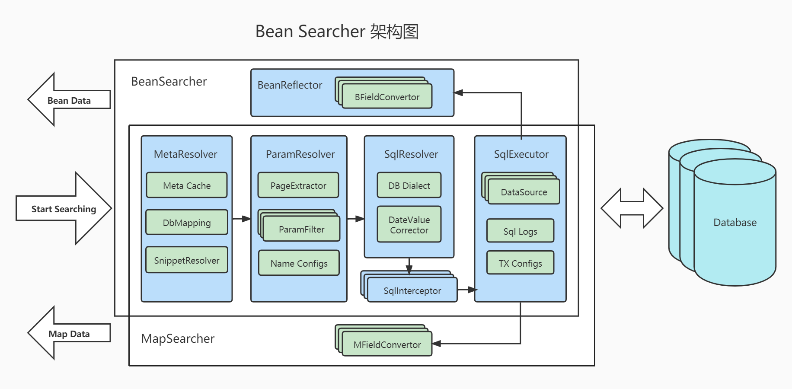

<p align="center">
  <a href="https://bs.zhxu.cn/" target="_blank">
    
  </a>
</p>
<p align="center">
  <a href="https://gitee.com/troyzhxu/bean-searcher/stargazers"></a>
  <a href="https://gitee.com/troyzhxu/bean-searcher/members"></a>
  <a href="https://github.com/troyzhxu/bean-searcher/stargazers"></a>
  <a href="https://github.com/troyzhxu/bean-searcher/network/members"></a>
  <a href="https://gitee.com/troyzhxu/bean-searcher/blob/master/LICENSE"></a>
</p>

English | [中文](./README.zh-CN.md)

* Documentation: https://bs.zhxu.cn
* 🚀 **Online Demo**: https://demo-bs.zhxu.cn/
* JueJin blogs:
  - [Writing code like this is 100 times more efficient than using MyBatis directly!](https://juejin.cn/post/7027733039299952676)
  - [What's the difference between Bean Searcher and MyBatis Plus?](https://juejin.cn/post/7092411551507808264)

> **Bean Searcher is the GraphQL of list retrieval** — entities define search boundaries, parameters drive query logic. No special protocol required, just add one dependency.
>
> Single-table entities are searchable with zero annotations. Multi-table joins, pagination, filtering, sorting, and stats — all in one line of code.

### 🎯 Core Capabilities

| Pain point | Traditional approach | Bean Searcher |
|---|---|---|
| **Multi-condition list queries** | if-else SQL concatenation / Specification | One line, parameter-driven |
| **Multi-table joins** | Manual JOIN / XML mapping | Annotation-declared, auto-generated SQL |
| **Frontend dynamic filtering** | Add fields, change backend APIs | Zero backend changes, frontend freely combines |
| **Non-invasive integration** | Spring Data REST: expose repositories, restructure URLs | One dependency, inject `BeanSearcher`, existing code untouched |

> **Get started in one minute:**
> ```groovy
> implementation "cn.zhxu:bean-searcher-boot-starter:${latestVersion}"
> ```
> Single-table search works out-of-the-box with zero annotations on your existing entity.

### ⁉️ WHY

#### Declarative Search vs Imperative Coding

MyBatis / Hibernate excel at CRUD, but when it comes to list retrieval with **multi-condition filtering, table joins, sorting, and pagination**, they often require piles of if-else condition stitching and VO conversion code.

Bean Searcher solves this with **declarative search**:
* **Entity as Declaration** — The SearchBean defines "what can be searched"; annotations are optional
* **Parameters as Query** — The frontend controls "what is searched"; one endpoint handles endless combinations
* **Zero Protocol Burden** — Works on standard HTTP parameters, no special protocol needed

Just as GraphQL lets clients freely specify which fields to return in one request, Bean Searcher lets clients freely specify filter conditions, sort order, pagination, and stats — without a dedicated schema, all in one line of code.

> See [📊 Comparison](#-comparison) for concrete code-to-code comparison with MyBatis and Spring Data JPA implementations in the demo project.

### 💥 Achieved with one line of code

Start with your existing domain/VO class — annotations are optional (zero-annotation for single-table, add a few for joins):

```java
@SearchBean(tables="user u, role r", joinCond="u.role_id = r.id", autoMapTo="u")
public class User {
  private long id;
  private String username;
  private int status;
  private int age;
  private String gender;
  private Date joinDate;
  private int roleId;
  @DbField("r.name")
  private String roleName;
  // Getters and setters...
}
```

Then you can complete the API with one line of code:

```java
@RestController
@RequestMapping("/user")
public class UserController {

    @Autowired
    private BeanSearcher beanSearcher;              // Inject BeanSearcher

    @GetMapping("/index")
    public SearchResult<User> index(HttpServletRequest request) {
        // Only one line of code written here
        return beanSearcher.search(User.class, MapUtils.flat(request.getParameterMap()), User::getAge);
    }

}
```

This line of code can achieve:

* **Retrieval from multi tables**
* **Pagination by any field**
* **Combined filter by any field**
* **Sorting by any field**
* **Summary with `age` field**

For example, this API can be requested as follows:

* `GET: /user/index` — default pagination
* `GET: /user/index? page=1 & size=10` — specified pagination
* `GET: /user/index? status=1` — filter `status = 1`
* `GET: /user/index? name=Jac & name-op=sw` — `name` starts with `Jac`
* `GET: /user/index? name=Jack & name-ic=true` — `name = Jack` (case ignored)
* `GET: /user/index? sort=age & order=desc` — sort by `age` descending
* `GET: /user/index? onlySelect=username,age` — return `username` and `age` only
* `GET: /user/index? selectExclude=joinDate` — exclude `joinDate` field

### 📊 Comparison

The demo project includes implementations of the **same API** using MyBatis and Spring Data JPA — same tables, same data, same response — so you can compare side-by-side:

| Aspect | Bean Searcher | MyBatis | Spring Data JPA |
|---|---|---|---|
| **Controller code** | **1 line** | ~280 lines | ~280 lines |
| **Extra files** | 0 | 1 Mapper + 1 XML | 2 Entities + 1 Repository |
| **SQL generation** | Declarative annotations | Manual XML | Criteria API |
| **Source** | [backend-springboot4](./bean-searcher-demos/backend-springboot4) | [backend-vs-mybatis](./bean-searcher-demos/backend-vs-mybatis) | [backend-vs-jpa](./bean-searcher-demos/backend-vs-jpa) |

The Bean Searcher version:

```java
return beanSearcher.search(User.class, User::getAge);
```

The MyBatis / JPA versions need handwritten parameter parsing, dynamic condition assembly, three separate queries (list / count / sum), pagination, sorting, and CSV streaming — all handled by this one line in Bean Searcher.

### 🖥 Demos

🖥 [Online Demo](https://demo-bs.zhxu.cn/) ｜ 💻 [Run Locally](./bean-searcher-demos) — Bean Searcher, MyBatis, and JPA comparison implementations

### ✨ Parameter builder

For programmatic query building (not just HTTP parameters), use the type-safe builder API:

```java
Map<String, Object> params = MapUtils.builder()
        .selectExclude(User::getJoinDate)                 // Exclude joinDate field
        .field(User::getStatus, 1)                        // Filter: status = 1
        .field(User::getName, "Jack").ic()                // Filter: name = 'Jack' (case ignored)
        .field(User::getAge, 20, 30).op(Opetator.Between) // Filter: age between 20 and 30
        .orderBy(User::getAge, "asc")                     // Sort by age ascending 
        .page(0, 15)                                      // Pagination: page=0 and size=15
        .build();
List<User> users = beanSearcher.searchList(User.class, params);
```

### 🌱 Easy integration

Bean Searcher works with any Java Web framework, such as: SpringBoot, Spring MVC, Grails, Jfinal and so on.

#### SpringBoot / Grails

All you need is to add a dependency:

```groovy
implementation "cn.zhxu:bean-searcher-boot-starter:${latestVersion}"
```

and then you can inject Searcher into a `Controller` or `Service`:

```groovy
@Autowired
private MapSearcher mapSearcher;      // Retrieved data as Map objects

@Autowired
private BeanSearcher beanSearcher;    // Retrieved data as generic objects
```

#### Solon Project

All you need is to add a dependency:

```groovy
implementation "cn.zhxu:bean-searcher-solon-plugin:${latestVersion}"
```

and then you can inject Searcher into a `Controller` or `Service`:

```groovy
@Inject
private MapSearcher mapSearcher;

@Inject
private BeanSearcher beanSearcher;
```

#### Other frameworks

Adding this dependency:

```groovy
implementation "cn.zhxu:bean-searcher:${latestVersion}"
```

then you can build a `Searcher` with `SearcherBuilder`:

```java
DataSource dataSource = ...     // Get the dataSource of the application

// DefaultSqlExecutor supports multi datasources
SqlExecutor sqlExecutor = new DefaultSqlExecutor(dataSource);

// Build a MapSearcher
MapSearcher mapSearcher = SearcherBuilder.mapSearcher()
        .sqlExecutor(sqlExecutor)
        .build();

// Build a BeanSearcher
BeanSearcher beanSearcher = SearcherBuilder.beanSearcher()
        .sqlExecutor(sqlExecutor)
        .build();
```

### 🔨 Easy extended

You can customize and extend any component in Bean Searcher.

For example:
* Customizing [`FieldOp`](/bean-searcher/src/main/java/cn/zhxu/bs/FieldOp.java) to support other field operators
* Customizing [`DbMapping`](/bean-searcher/src/main/java/cn/zhxu/bs/DbMapping.java) to support other ORM annotations
* Customizing [`ParamResolver`](/bean-searcher/src/main/java/cn/zhxu/bs/ParamResolver.java) to support JSON query params
* Customizing [`FieldConvertor`](/bean-searcher/src/main/java/cn/zhxu/bs/FieldConvertor.java) to support any type of field
* Customizing [`Dialect`](/bean-searcher/src/main/java/cn/zhxu/bs/dialect/Dialect.java) to support more databases
* and so on

### 🏗 Architecture



* [Changelog](./CHANGELOG.md)
* [Performance report](./performance/README.md)

### 📚 Detailed documentation

Reference: https://bs.zhxu.cn

### 🤝 Friendship links

- [**[ Sa-Token ]**](https://github.com/dromara/Sa-Token): A lightweight Java permission authentication framework that makes authorization simple and elegant!
- [**[ Fluent MyBatis ]**](https://gitee.com/fluent-mybatis/fluent-mybatis): MyBatis syntax enhancement framework, combining features and advantages of MyBatisPlus, DynamicSql, Jpa etc., generating code with annotation processors
- [**[ OkHttps ]**](https://gitee.com/troyzhxu/okhttps): Lightweight yet powerful HTTP client, universal for front-end and back-end, supporting WebSocket and Stomp protocols
- [**[ hrun4j ]**](https://github.com/lematechvip/hrun4j): API automation testing solution
- [**[ JsonKit ]**](https://gitee.com/troyzhxu/xjsonkit): Ultra-lightweight JSON facade, simple to use, independent of specific implementation, decoupling business code from Jackson, Gson, Fastjson etc.!
- [**[ Free UI ]**](https://gitee.com/phoeon/free-ui): Based on Vue3 + TypeScript, a very lightweight and cool UI component library!

### ❤️ How to contribute

1. Fork the code!
2. Create your own branch: `git checkout -b feat/xxxx`
3. Submit your changes: `git commit -am 'feat(function): add xxxxx'`
4. Push your branch: `git push origin feat/xxxx`
5. Submit `pull request`
