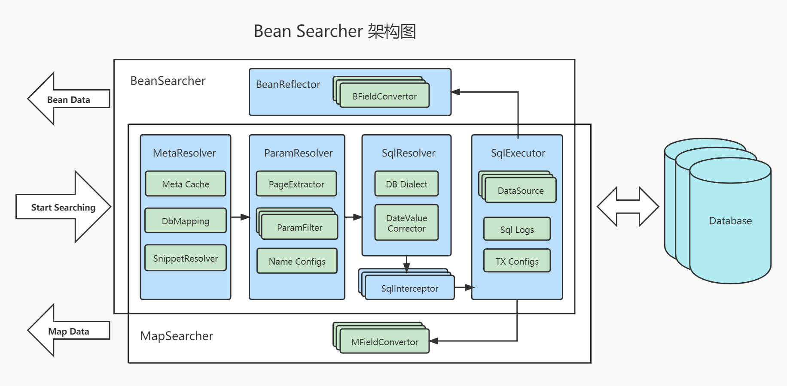

<p align="center">
  <a href="https://bs.zhxu.cn/" target="_blank">
    
  </a>
</p>
<p align="center">
  <a href="https://maven-badges.herokuapp.com/maven-central/com.ejlchina/bean-searcher/"></a>
  <a href="https://gitee.com/troyzhxu/bean-searcher/blob/master/LICENSE"></a>
  <a href="https://github.com/troyzhxu"></a>
</p>

中文 | [English](./README.md)

* 文档：https://bs.zhxu.cn/
* 掘金博客：
  - [这样写代码，比直接使用 MyBatis 效率提高了 100 倍！](https://juejin.cn/post/7027733039299952676)
  - [最近火起的 Bean Searcher 与 MyBatis Plus 倒底有啥区别？](https://juejin.cn/post/7092411551507808264)
* 框架目的：只一行代码实现：
  - **多表联查**
  - **分页搜索**
  - **任意字段组合过滤**
  - **任意字段排序**
  - **多字段统计**
  - **直接得到 VO**
* 设计思想：[Bean Searcher 的设计思想](https://bs.zhxu.cn/guide/latest/introduction.html#%E8%AE%BE%E8%AE%A1%E5%93%B2%E5%AD%A6)
* 架构图：



* 更新日志：[CHANGELOG](./CHANGELOG.md)
* 性能如何：[直接说一骑绝尘你可能觉得是 Tree New Bee, 还是看报告好了](./performance/README.md)

### ✨ 特性

* 支持 **实体多表映射**
* 支持 **动态字段运算符**
* 支持 **分组聚合 查询**
* 支持 **Select | Where | From 子查询**
* 支持 **实体类嵌入参数**
* 支持 **字段转换器**
* 支持 **Sql 拦截器**
* 支持 **数据库 Dialect 扩展**
* 支持 **多数据源 与 动态数据源**
* 支持 **注解缺省 与 自定义**
* 支持 **字段运算符 扩展**
* 等等

### ⁉️为什么用

#### 这绝不是一个重复的轮子

虽然 **增删改** 是 hibernate 和 mybatis、data-jdbc 等等 ORM 的强项，但查询，特别是有 **多条件**、**联表**、**分页**、**排序** 的复杂的列表查询，却一直是它们的弱项。

传统的 ORM 很难用较少的代码实现一个复杂的列表检索，但 Bean Searcher 却在这方面下足了功夫，这些复杂的查询，几乎只用一行代码便可以解决。

* 例如，这样的一个典型的需求：


后端需要写一个检索接口，而如果用传统的 ORM 来写，代码之复杂是可以想象的。

而 Bean Searcher 却可以：

### 💥 只一行代码实现以上功能

首先，你有一个实体类：

```java
@SearchBean(tables="user u, role r", joinCond="u.role_id = r.id", autoMapTo="u")
public class User {
  private long id;
  private String username;
  private int status;
  private int age;
  private String gender;
  private Date joinDate;
  private int roleId;
  @DbField("r.name")
  private String roleName;
  // Getters and setters...
}
```

然后你就可以用一行代码实现这个用户检索接口：

```java
@RestController
@RequestMapping("/user")
public class UserController {

    @Autowired
    private BeanSearcher beanSearcher;              // 注入 BeanSearcher 的检索器

    @GetMapping("/index")
    public SearchResult<User> index(HttpServletRequest request) {
        // 这里只写一行代码
        return beanSearcher.search(User.class, MapUtils.flat(request.getParameterMap()), new String[]{ "age" });
    }
	
}
```

这一行代码实现了以下功能：

* **多表联查**
* **分页搜索**
* **组合过滤**
* **任意字段排序**
* **字段统计**

例如，该接口支持如下请求：

* `GET: /user/index`

  无参请求（默认分页）:
  ```json
  {
    "dataList": [
      {
        "id": 1,
        "username": "Jack",
        "status": 1,
        "level": 1,
        "age": 25,
        "gender": "Male",
        "joinDate": "2021-10-01"
      },
      ...     // 默认返回 15 条数据
    ],
    "totalCount": 100,
    "summaries": [
      2500    // age 字段统计
    ]
  }
  ```

* `GET: /user/index? page=1 & size=10`

  指定分页参数

* `GET: /user/index? status=1`

  返回 `status = 1` 的用户

* `GET: /user/index? name=Jac & name-op=sw`

  返回 `name` 已 `Jac` 开头的用户

* `GET: /user/index? name=Jack & name-ic=true`

  返回 `name = Jack`（忽略大小写）的用户

* `GET: /user/index? sort=age & order=desc`

  按字段 `age` 降序查询

* `GET: /user/index? onlySelect=username,age`

  只检索 `username` 与 `age` 两个字段:
  ```json
  {
    "dataList": [
      {
        "username": "Jack",
        "age": 25
      },
      ...
    ],
    "totalCount": 100,
    "summaries": [
      2500
    ]
  }
  ```
* `GET: /user/index? selectExclude=joinDate`

  检索时排除 `joinDate` 字段

### ✨ 参数构建器

```java
Map<String, Object> params = MapUtils.builder()
        .selectExclude(User::getJoinDate)                 // 排除 joinDate 字段
        .field(User::getStatus, 1)                        // 过滤：status = 1
        .field(User::getName, "Jack").ic()                // 过滤：name = 'Jack' (case ignored)
        .field(User::getAge, 20, 30).op(Opetator.Between) // 过滤：age between 20 and 30
        .orderBy(User::getAge, "asc")                     // 排序：年龄，从小到大
        .page(0, 15)                                      // 分页：第 0 页, 每页 15 条
        .build();
List<User> users = beanSearcher.searchList(User.class, params);
```

**DEMO 快速体验**：

* [v4.x - demos](./bean-searcher-demos)
* [v3.x - demos](https://gitee.com/troyzhxu/bean-searcher/tree/v3.8/bean-searcher-demos)

### 🚀 快速开发

使用 Bean Searcher 可以极大地节省后端的复杂列表检索接口的开发时间！

* 普通的复杂列表查询只需一行代码
* 单表检索可复用原有 `Domain`，无需定义 `SearchBean`

### 🌱 集成简单

可以和任意 Java Web 框架集成，如：SpringBoot、Spring MVC、Grails、Jfinal 等等。

#### Spring Boot 项目，添加依赖即集成完毕：

```groovy
implementation 'cn.zhxu:bean-searcher-boot-stater:4.2.9'
```

接着便可在 `Controller` 或 `Service` 里注入检索器：

```groovy
/**
 * 注入 Map 检索器，它检索出来的数据以 Map 对象呈现
 */
@Autowired
private MapSearcher mapSearcher;

/**
 * 注入 Bean 检索器，它检索出来的数据以 泛型 对象呈现
 */
@Autowired
private BeanSearcher beanSearcher;
```

#### Solon 项目，添加依赖即集成完毕：

```groovy
implementation 'cn.zhxu:bean-searcher-solon-plugin:4.2.9'
```

接着便可在 `Controller` 或 `Service` 里注入检索器：

```groovy
/**
 * Inject a MapSearcher, which retrieved data is Map objects
 */
@Inject
private MapSearcher mapSearcher;

/**
 * Inject a BeanSearcher, which retrieved data is generic objects
 */
@Inject
private BeanSearcher beanSearcher;
```

#### 其它框架，使用如下依赖：

```groovy
implementation 'cn.zhxu:bean-searcher:4.2.9'
```

然后可以使用 `SearcherBuilder` 构建一个检索器：

```java
DataSource dataSource = ...     // 拿到应用的数据源

// DefaultSqlExecutor 也支持多数据源
SqlExecutor sqlExecutor = new DefaultSqlExecutor(dataSource);

// 构建 Map 检索器
MapSearcher mapSearcher = SearcherBuilder.mapSearcher()
        .sqlExecutor(sqlExecutor)
        .build();

// 构建 Bean 检索器
BeanSearcher beanSearcher = SearcherBuilder.beanSearcher()
        .sqlExecutor(sqlExecutor)
        .build();
```

### 🔨 扩展性强

面向接口设计，用户可自定义扩展 Bean Searcher 中的任何组件！

比如你可以：
* 自定义 [`FieldOp`](/bean-searcher/src/main/java/com/ejlchina/searcher/FieldOp.java) 来支持更多的字段运算符
* 自定义 [`FieldConvertor`](/bean-searcher/src/main/java/com/ejlchina/searcher/FieldConvertor.java) 来支持任意的 特殊字段类型
* 自定义 [`DbMapping`](/bean-searcher/src/main/java/com/ejlchina/searcher/DbMapping.java) 来实现自定义注解，或让 Bean Searcher 识别其它 ORM 的注解
* 自定义 [`ParamResolver`](/bean-searcher/src/main/java/com/ejlchina/searcher/ParamResolver.java) 来支持其它形式的检索参数
* 自定义 [`Dialect`](/bean-searcher/src/main/java/com/ejlchina/searcher/Dialect.java) 来支持更多的数据库
* 等等..

### 📚 详细文档

参阅：https://bs.zhxu.cn/

文档已完善！

### 📅 开发计划

* v4.3: 参数构建器支持 and 与 or 便捷方法
* v4.4: 条件模板
* v4.5: 内嵌对象/列表

### 🤝 友情接链

[**[ Sa-Token ]** 一个轻量级 Java 权限认证框架，让鉴权变得简单、优雅！](https://github.com/dromara/Sa-Token)

[**[ Fluent MyBatis ]** MyBatis 语法增强框架, 综合了 MyBatisPlus, DynamicSql,Jpa 等框架的特性和优点，利用注解处理器生成代码](https://gitee.com/fluent-mybatis/fluent-mybatis)

[**[ OkHttps ]** 轻量却强大的 HTTP 客户端，前后端通用，支持 WebSocket 与 Stomp 协议](https://gitee.com/troyzhxu/okhttps)

[**[ hrun4j ]** 接口自动化测试解决方案 --工具选得好，下班回家早；测试用得对，半夜安心睡 ](https://github.com/lematechvip/hrun4j)

[**[ JsonKit ]** 超轻量级 JSON 门面工具，用法简单，不依赖具体实现，让业务代码与 Jackson、Gson、Fastjson 等解耦！](https://gitee.com/troyzhxu/xjsonkit)

[**[ Free UI ]** 基于 Vue3 + TypeScript，一个非常轻量炫酷的 UI 组件库 ！](https://gitee.com/phoeon/free-ui)


### ❤️ 参与贡献

1.  Star and Fork 本仓库
2.  新建 Feat_xxx 分支（新功能基于 dev 分支，bugfix 基于特定版本的分支）
3.  提交代码
4.  新建 Pull Request

