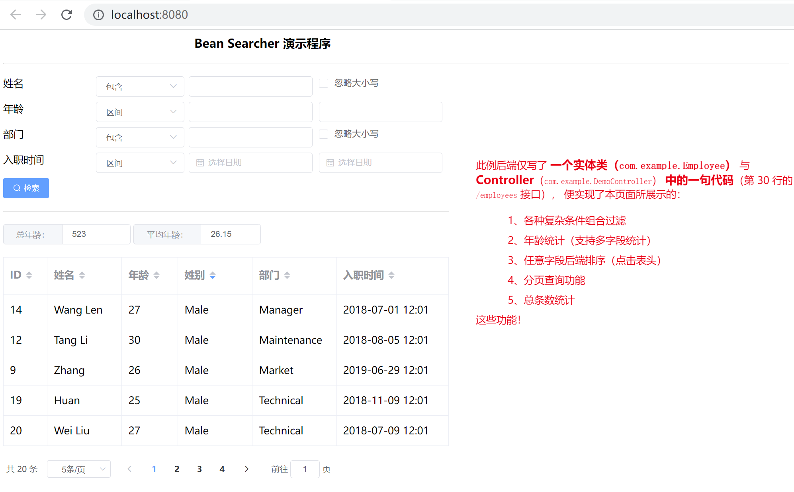

# Bean Searcher Solon Demo

### 介绍

本项目主要用于演示 [Bean Searcher](https://gitee.com/troyzhxu/bean-searcher) 在 Web 工程中的使用方式，以及展示在列表检索场景中 [Bean Searcher](https://gitee.com/troyzhxu/bean-searcher) 是如何提升我们的开发效率。

### 软件架构
软件架构说明

- Web框架：solon
- 数据库：h2 （无需安装配置）
- 数据库访问：wood、bean-searcher
- 模板引擎：thymeleaf
- 前端框架：vue、element-ui

### 三步运行 DEMO

```bash
> git clone https://github.com/troyzhxu/bean-searcher.git
> cd bean-searcher/bean-searcher-demos/bs-demo-solon
> IDEA 打开运行
```

### 运行效果

##### 1. 打开浏览器访问：[http://localhost:8080/](http://localhost:8080/) 效果如下：



如果页面有乱码，则添加 JVM 参数：-Dfile.encoding=utf-8

##### 2. 如上图，本示例展示了一个简单的员工列表页面，实现了如下功能：

* 各种复杂条件组合过滤

* 年龄统计（支持多字段统计）

* 任意字段后端排序（点击表头）

* 分页查询功能

* 总条数统计

OK，页面做的虽然粗糙，但是一个列表检索的功能基本上展示了，下面主要看下在后端, Bean Searcher 是如何简化我们的代码。

### 代码分析

##### 控制层代码

有同学看到这会想，若要实现以上演示的的可以按照各种条件 **组合检索**、**排序**、**分页** 和 **统计** 的功能，那后端的代码量至少也得上百行吧。Bean Searcher 告诉你，不用，关键代码，就一句！啥？我怎么不信？请看代码：

```java
@Controller
public class DemoController {

    @Inject
    private BeanSearcher beanSearcher;

    @Mapping("/")
    public ModelAndView index() {
        return new ModelAndView("index.html");
    }

    @Mapping("/employees")
    public SearchResult<Employee> employees() {
        // 分页查询员工信息，并对年龄进行统计
        return beanSearcher.search(Employee.class, Employee::getAge);
    }

}
```

### 总结

- [Bean Searcher](https://gitee.com/troyzhxu/bean-searcher) 设计的目标并不是替代某个ORM框架，它只是为了弥补现有ORM框架在复杂列表检索中的不便，实际项目中，配合使用它们，效果或会更好。
- 本例只是 [Bean Searcher](https://gitee.com/troyzhxu/bean-searcher) 在联表检索中的一个简单的演示，更多用法，请参阅: [https://bs.zhxu.cn](https://bs.zhxu.cn)
- 看完这些，大家有没有觉得 [Bean Searcher](https://gitee.com/troyzhxu/bean-searcher) 正好可以帮到你呢？如果是，就点个 Star 吧 ^_^

### 参与贡献

1. Fork 本仓库
2. 新建 Feat_xxx 分支
3. 提交代码
4. 新建 Pull Request
